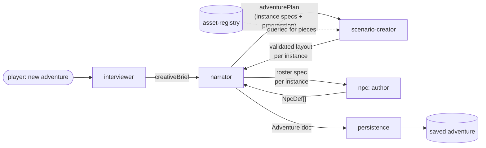
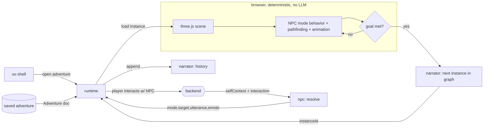

# 02 - Architecture

Built on [01-INTERPRETATION.md](01-INTERPRETATION.md) and governed by
[CONTRACT-CONVENTION.md](CONTRACT-CONVENTION.md). Every box below is an isolated blackbox folder
under `layers/` with its own `CONTRACT.md` + `schema/`. Arrows are DATA crossing a contract, never
a code import.

## The layers

| Layer | Side | LLM? | Single responsibility |
|---|---|---|---|
| `ux-shell` | frontend | no | App chrome: menus, adventure browser, new/import/export, HUD frame. Isolated from the 3D canvas. |
| `runtime` | frontend | no | Load and PLAY one instance in three.js: render, move, pathfind, animate, speech bubbles, goal checks, progression transitions. |
| `interviewer` | backend | yes (skippable) | Turn player preferences (or nothing) into a **creative brief**. |
| `narrator` | backend | yes + graph | Plan the **Adventure** from the brief (instances, goals, progression graph, NPC rosters). Own play-time instance init + interaction history. |
| `scenario-creator` | backend | yes, structured, per-instance | Turn one instance spec into a geometrically valid 3D **layout** (rooms, portals, objects, spawns). Owns the geometry validator every generator is held to. |
| `city-planner` | backend | no | Lay one outdoor street level: road network, a front door per lot, the entry point, the locked exit gate, and a `LotPlan` per building. |
| `building-planner` | backend | no | Turn one `LotPlan` into the floors behind its door: rooms, interior doors, a stairwell, and a way back out. A house is a one-floor building. |
| `map-state` | shared | no | The run's ledger: derive the world map from the Adventure, track what has been entered, cleared and seen, and decide what is open (including the exit gate). |
| `npc` | backend | yes, sparse | Author NPC definitions at author-time; resolve one player interaction into `{mode, target, utterance, emote}` at play-time. |
| `asset-registry` | shared | no | The manifest of usable 3D pieces (kit parts + generated assets): id, kind, size, snap points, glTF URL, license. |
| `asset-gen` | backend | yes (async, optional) | Generate/enrich 3D assets (ComfyUI on the AMD box or an API) and register them in `asset-registry`. |
| `persistence` | backend | no | Serialize/deserialize, save/load, export/import an Adventure as a portable file. |

`asset-gen` is optional and asynchronous: the engine is fully playable from `asset-registry`'s
curated kits alone; generation only enriches the manifest over time.

## The central artifact: the Adventure document

Everything author-time produces, and everything play-time consumes, is one portable JSON document.
This is the wire format that keeps the phases decoupled. Its top-level shape (full schema lives in
`layers/persistence/schema/`):

```
Adventure {
  meta            { id, title, createdAt, contractVersion, seed }
  creativeBrief   { universes[], likedNpcs[], tone, difficulty, freeText }   // from interviewer
  progression     { nodes: InstanceId[], edges: { from, to, unlock: GoalRef }[], start }
  instances: Instance[] {
    id, theme, rules,
    rooms:   Room[]    { id, position, size, floorKit, wallKit, objects[], inventory[] }
    portals: Portal[]  { id, roomA, roomB|EXIT, position, axis, size }
    npcs:    NpcDef[]   // see npc layer
    goal:    Goal       // machine-checkable
    spawn:   { position, facing }
  }
  history: InteractionRecord[]   // appended at play-time by the narrator
}
```

An Adventure is self-contained except for asset bytes: rooms/objects reference `asset-registry`
ids, so a saved Adventure is small. Export bundles any *generated* (non-kit) assets alongside it.

## Author-time pipeline (rare, LLM-heavy, produces an Adventure)



- The interviewer can be **skipped**: it emits a minimal or empty brief and the narrator invents
  the rest. The seam is identical either way (a `creativeBrief` in, whatever its richness).
- The narrator spawns **one scenario-creator invocation per instance**, each sandboxed to that
  instance's theme so instances stay isolated from each other (the brief's "its own agent, its
  own context, only its own domain").
- The scenario-creator's output is validated (schema + geometry: no overlaps, every room
  reachable, portals aligned) BEFORE it is accepted. Invalid layouts are regenerated, not shipped.

## Play-time loop (continuous, LLM-light, consumes an Adventure)



At play-time the browser runs entirely on its own. Two things cross to the backend: a **player
interaction** (returns one NPC decision) and **history append**. Goal checking and stage advance
are local reads of the authored Adventure; the narrator only returns the next node id.

## Frontend / backend split (small on purpose)

The backend API surface is tiny (this is why the brief calls the backend "simple in a way"):

| Endpoint | Layer(s) behind it | In | Out |
|---|---|---|---|
| `POST /adventure` | interviewer -> narrator -> scenario-creator -> npc | creativeBrief (or empty) | Adventure doc |
| `GET/PUT /adventure/:id` | persistence | id / Adventure | Adventure doc |
| `POST /adventure/import`, `GET /adventure/:id/export` | persistence | file / id | Adventure / file |
| `POST /interaction` | npc (resolve) + narrator (history) | selfContext + interaction | interactionResult |
| `POST /asset/generate` (optional, async) | asset-gen -> asset-registry | asset request | asset id (later) |

Everything else (rendering, movement, animation, speech bubbles, goal logic, progression) lives in
the browser and calls nothing.

## Isolation boundaries in practice

- `runtime` depends only on the **Adventure schema** and the **interactionResult schema**. It never
  knows how any of it was authored. Swap the whole author-time stack and the runtime is unaffected.
- `scenario-creator` depends only on an **instance spec schema** (in) and the **layout schema** (out),
  plus `asset-registry`'s query contract. Rewrite its internals or its model freely.
- `npc` depends only on **selfContext schema** (in) and **interactionResult schema** (out). Its brain
  can be a 1B local model today and something else tomorrow with zero ripple.
- `asset-gen` writes only through `asset-registry`'s contract; nothing depends on `asset-gen`
  directly, so the whole generation feature can be absent and the engine still runs.

## Cross-cutting doctrines (inherited from gamentic)

Two rules apply inside every backend layer, carried over from gamentic (see
[05-GAMENTIC-LINEAGE.md](05-GAMENTIC-LINEAGE.md)):

- **Validated-mutation doctrine.** A model never mutates state as free prose. Every state change
  an LLM makes is a call whose arguments are constrained by a JSON Schema, applied by a
  deterministic handler that validates and can reject it. "A field the schema does not describe
  does not exist." At author-time this is how the scenario-creator emits layout; at play-time it
  is how the npc layer returns a mode switch. The schema that constrains generation IS the same
  schema in the layer's `schema/` folder, so the contract and the model are never out of sync.
- **Provider adapters.** Every call to an external model (text LLM, TTS, image or 3D generator)
  goes through a per-modality adapter resolved by config (env), never a hard-wired SDK. Swapping
  a local GGUF model for a cloud endpoint, or Maya-style local TTS for a hosted voice, is a config
  change, not a code change. Capability gaps degrade deterministically and silently (no emotion
  support: drop the tag; no 3D gen: fall back to a kit asset).

## Tech choices

Layer responsibilities above are tech-agnostic on purpose. The concrete libraries and models
(three.js rendering stack, speech-bubble lib, pathfinding, local LLM runtime, structured-output
mechanism, ComfyUI feasibility, asset kits) are decided in
[04-TECH-STACK.md](04-TECH-STACK.md), and each plugs in behind the contract of exactly one layer.
